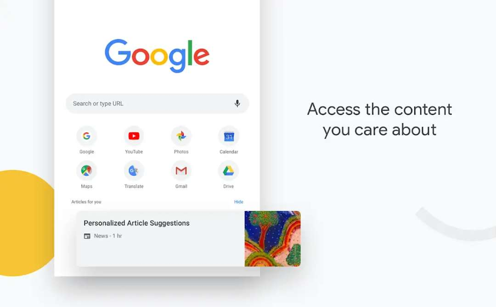

----------
## 谈谈那些优秀的手机浏览器
浏览器数量很多，而我只想说优秀的。

> 谷歌浏览器Google 
> 
		这是谷歌公司推出的强大浏览器，也是我用的最多的浏览器。谷歌是全球搜索引擎巨头，其检索信息能力毋庸置疑，play上多达十亿的下载量足以证明它的强大。众所周知百度浏览器是国内的巨头浏览器（自家搜索引擎），本土化很强，但广告多，明显的内容竞价排名，所以在我看来它显得不够专业。而谷歌浏览器则是出奇干净简洁而又美观，自身还带了谷歌翻译，让我不禁以为这世间只有中文。同时它可以保存你说输入过的账号及密码，省去再次输入的麻烦。所有的标签和记录也会保存到你的账号信息中以便在多平台同步数据信息，它是一款专业而又强大的浏览器。但是手机端的浏览器不能安装插件，不过这并不能妨碍它成为我最喜欢的浏览器。

> 	Yandex
> 
      这款浏览器同样来自国外，并不是国内没有优秀的浏览器，我只是想先从国外说起。这是老毛子家的浏览器，是俄罗斯本土最大的浏览器，在play上的下载量超过5000万。它是基于Chrome内核的浏览器，所以和Chrome有许多相似之处，我比较喜欢它的UI设计以及可以随便切换的背景。它把谷歌浏览器手机端没有引入的插件扩展加了进去，并且也拥有许多Chrome的优点。插件的引入让手机更加高效。与之相似的还有火狐浏览器。
  
  

>  via
>  
     体积小，无广告，极简设计是众多网友对它的总结。只有500多k的体积，但麻雀虽小，却五脏俱全。各种搜索引擎自由切换，支持简单的外观自定义，也可以添加少部分国人开发的插件，支持ADM插件直接下载百度云资料。简洁的页面会让你忘记曾经百度那满屏的广告，同时还自带了很强的去广告功能。我想它的极简设计也许是许多高分评价的来源吧。一个简洁logo加一个搜索栏简单不拖泥带水，这在国内浏览器并不常见。与之类似的还有x浏览器，欧朋浏览器等。

> 

> 夸克浏览器

    曾经我喜欢过UC浏览器的流畅与简洁，不过后来它后来成为了第二个百度，满屏眼花缭乱的广告。不过庆幸的是原UC团队也重新打造了以快和轻为主的夸克浏览器，它像曾经的UC一样简洁，流畅得令人发指。它的UI设计也极其舒服，它是一款国内十分良心的浏览器。用着十分舒服，听说它还有什么AI引擎（现在已经不用它了）。

----------
